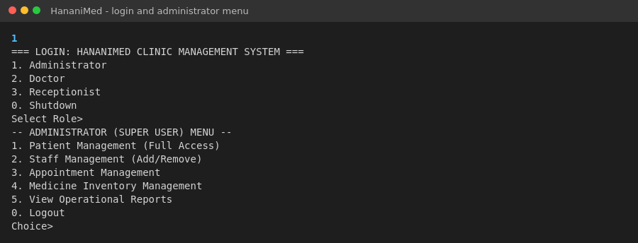
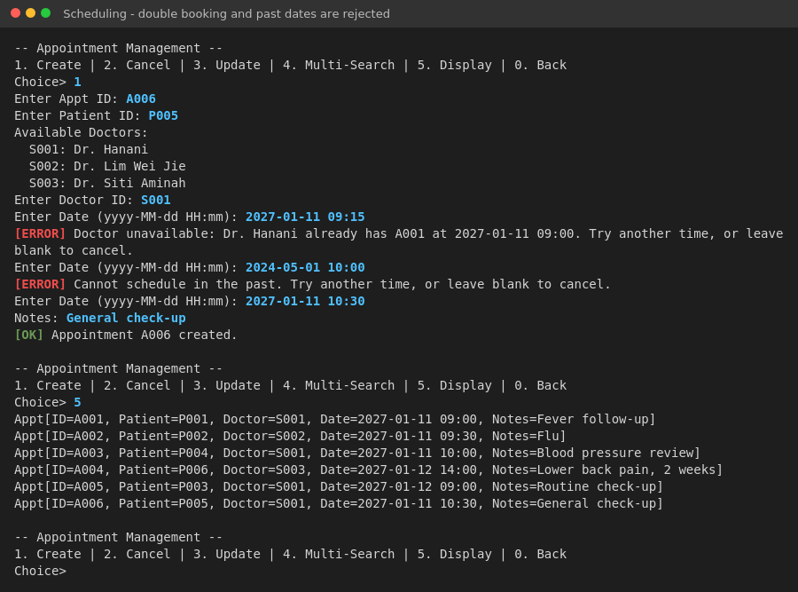
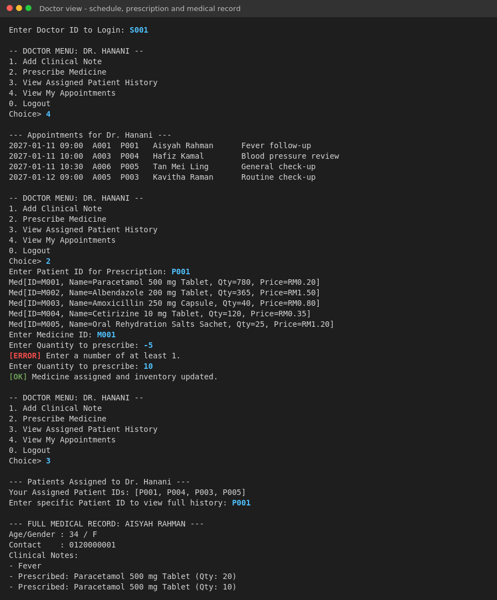
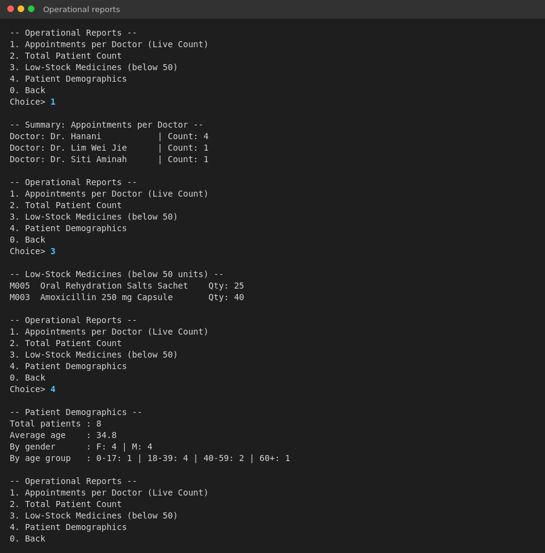
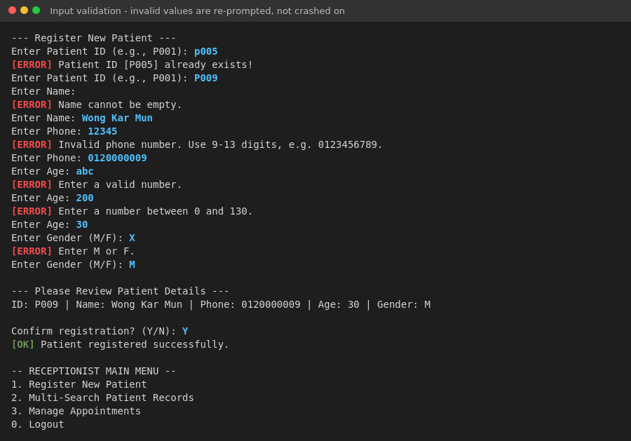
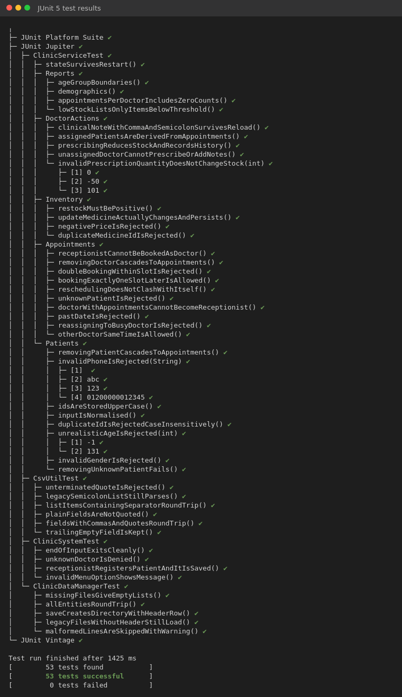
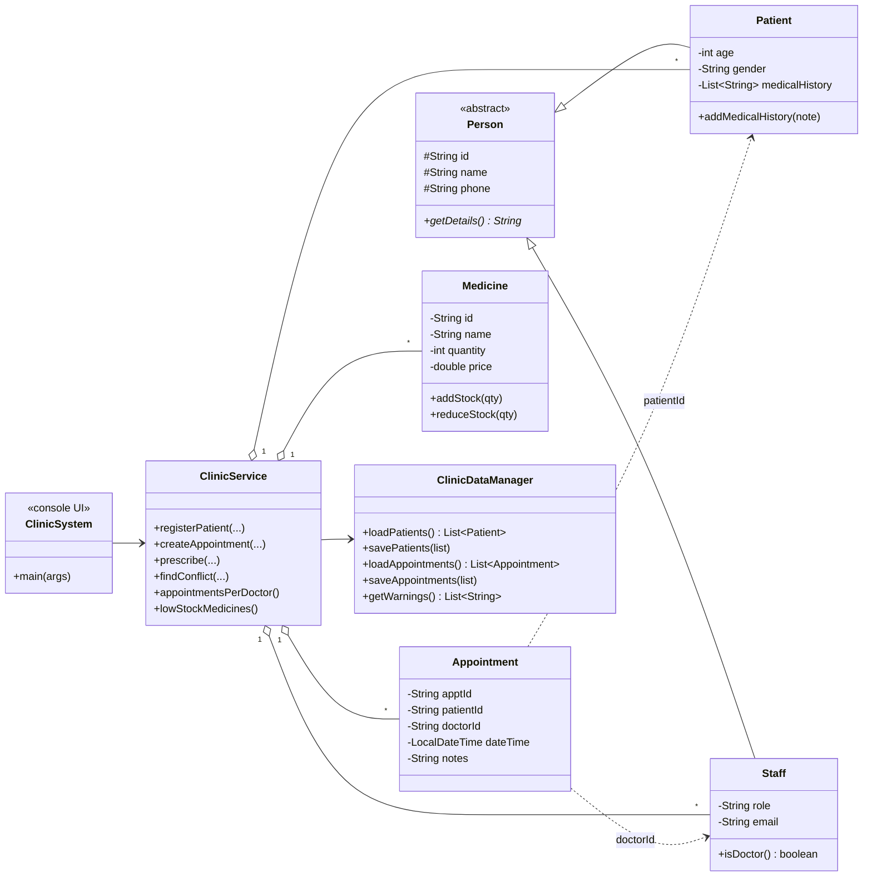

# HananiMed – Clinic Management System


A console-based clinic management system written in Java. It digitises the day-to-day work of a small clinic: patient registration, appointment scheduling with double-booking prevention, medicine inventory, staff records, doctor consultations and operational reports. All data is stored in plain CSV files.

Built as the group project for **BIC20904 Object-Oriented Programming** (Semester 1, 2025/2026), Faculty of Computer Science and Information Technology, Universiti Tun Hussein Onn Malaysia (UTHM). The case study is a fictional clinic, *Klinik Dr. Hanani*.



## Features

The system has three role-based menus:

| Role | What it can do |
|---|---|
| **Administrator** | Full CRUD on patients, staff, appointments and medicine inventory, plus operational reports |
| **Doctor** (logs in with a staff ID) | View own schedule, add clinical notes, prescribe medicine (stock is deducted), view medical history of assigned patients only |
| **Receptionist** | Register patients, multi-search patient records, manage appointments |

The main business rules are:

- A doctor cannot have two appointments less than **30 minutes** apart, and appointments cannot be booked in the past.
- A doctor can only see, annotate or prescribe for patients they have an appointment with.
- A prescription must be at least 1 unit and cannot exceed the available stock.
- Removing a patient or a doctor also removes their appointments, after the user confirms.
- IDs are unique and case-insensitive: `p011` is stored as `P011`. Phone, age, gender, role and email are validated on entry, and invalid input is re-prompted rather than crashing the program.
- Every change is saved to disk immediately. Corrupted CSV lines are skipped with a warning instead of stopping start-up.

## Tech stack

- **Java 17+** (standard library only; developed on JDK 21)
- **JUnit 5**: 53 unit and end-to-end tests
- **Maven**: build, tests and runnable JAR
- **GitHub Actions**: runs the test suite on every push
- **CSV files**: persistence, with RFC 4180 quoting

## How to run

You need JDK 17 or newer. Check with `java -version`.

**Option 1: Maven**

```bash
mvn test                      # run the 53 tests
mvn package                   # build target/hananimed.jar
java -jar target/hananimed.jar
```

**Option 2: no Maven (plain JDK)**

```bash
./run.sh          # macOS / Linux
run.bat           # Windows
```

**Option 3: IntelliJ IDEA.** Use *File → Open* and select `pom.xml`, then run `com.hananimed.ui.ClinicSystem`.

The program reads and writes the CSV files in `./data` by default. To use another folder, pass it as the first argument (`java -jar target/hananimed.jar my-data`) or set `-Dclinic.data.dir=...`. The folder is created automatically if it doesn't exist.

**Sample logins.** Administrator and Receptionist need no ID. For the Doctor role, use `S001`, `S002` or `S003`. All sample data is fictional.

## Results

### Double-booking and past-date prevention

The report's *Schedule Appointment* activity diagram includes a "Doctor Busy" check. This version implements it. A clash or a past date re-prompts for a new time:



### Doctor module

The doctor sees only their own schedule and patients. A negative prescription quantity is rejected, and a valid prescription deducts stock and is written to the patient's record:



### Operational reports

The original version had two reports: appointments per doctor and total patient count. Low-stock and patient-demographics reports were added after submission:



### Input validation



### Tests

There are 53 tests in total. They cover CSV parsing, file round-trips, every business rule above, and scripted end-to-end sessions through the real console menus.

<details>
<summary>Show full test tree</summary>



</details>

## Design

`Patient` and `Staff` inherit from the abstract `Person` class. All business rules live in `ClinicService`, separate from the console UI, which is what makes them unit-testable. `ClinicDataManager` handles CSV persistence.



The original report's UML diagrams are in [`docs/diagrams`](docs/diagrams): a [use case diagram](docs/diagrams/use-case-diagram.png) and the [Schedule Appointment activity diagram](docs/diagrams/schedule-appointment-activity.png).

**Data files** (`data/*.csv`, UTF-8, with a header row):

| File | Columns |
|---|---|
| `patients.csv` | id, name, phone, age, gender, medical_history (`;`-separated) |
| `staff.csv` | id, name, phone, role, email |
| `appointments.csv` | id, patient_id, doctor_id, date_time (`yyyy-MM-dd HH:mm`), notes |
| `medicine.csv` | id, name, quantity, price |

## Findings

- **Separating rules from I/O was the most valuable change.** In the submitted version, all logic sat inside a 700-line console class, so none of it could be tested. Several features described in the report turned out never to have been implemented once tests could be written against them, including double-booking prevention and the past-date check.
- **Naive CSV handling loses data silently.** The original split each line on commas, so a note such as `Fever, cough` shifted columns and the rest of the note disappeared on the next load. Proper quoting and escaping fixed this, and there are tests to prove it.
- **Validation belongs in one place.** Each menu used to validate input differently. One shared set of validators is now used both for re-prompting in the UI and for enforcing rules in the service. This closed holes such as negative prescription quantities increasing stock.

## Limitations

- **No real authentication.** Users pick a role from a menu, and doctors log in with a staff ID only, with no password. Role checks exist to show the access rules, not as security.
- **Not suitable for real patient data.** Records are stored as unencrypted plain text with no access control or audit log. A real clinic would need a database and compliance with Malaysia's PDPA.
- **Single user only.** There is no file locking, so two instances writing to the same folder can overwrite each other.
- Appointments have a fixed 30-minute slot, with no working hours, doctor leave or appointment status (attended / no-show).
- Inventory has no batch or expiry-date tracking, and prescriptions are not linked to a specific appointment.
- The interface is console-only.

## Project structure

```
hananimed-clinic-management-system/
├── .github/workflows/ci.yml        # runs mvn verify on every push
├── data/                           # sample CSV data (fictional)
│   ├── appointments.csv
│   ├── medicine.csv
│   ├── patients.csv
│   └── staff.csv
├── docs/
│   ├── diagrams/                   # UML from the original report
│   └── screenshots/                # captured from real runs
├── src/
│   ├── main/java/com/hananimed/
│   │   ├── model/                  # Person, Patient, Staff, Appointment, Medicine
│   │   ├── persistence/            # ClinicDataManager, CsvUtil
│   │   ├── service/                # ClinicService (business rules), ClinicException
│   │   └── ui/                     # ClinicSystem (console menus, main)
│   └── test/java/com/hananimed/    # JUnit 5 tests
├── CHANGELOG.md
├── pom.xml
├── run.bat
└── run.sh
```

## Team (Group 13)

| Member | Role in the original project |
|---|---|
| Ariff Danial bin Rusli | Project Manager |
| Muhammad Faizzudin bin Fariq | Programmer: core entities, patient and staff modules, CSV I/O |
| Muhammad Faiz Izwan bin Zolkifli | Programmer: appointment and inventory modules |
| Musaab Fahmi Fadhl Al-Husaini | System Analyst: requirements, patient and staff activity diagrams, CSV structure and validation rules |
| Abdelrahman Mohamed Abdeldin Osman | System Analyst: appointment and inventory diagrams, test cases |

### What changed after submission

After the course ended, Musaab Fahmi Fadhl Al-Husaini refactored and extended the submitted code for this portfolio version. The changes were: business logic moved into `ClinicService` with Maven packages; 53 JUnit tests; bug fixes (medicine update that didn't save, negative prescriptions adding stock, CSV corruption from commas, crashes on non-numeric input, duplicate medicine IDs, false "removed" messages); implementation of the double-booking and past-date checks described in the report; low-stock and demographics reports; a doctor schedule view; confirmation before deletes; header rows and atomic saves for the CSV files; fictional sample data; and CI. See [CHANGELOG.md](CHANGELOG.md) for details.
